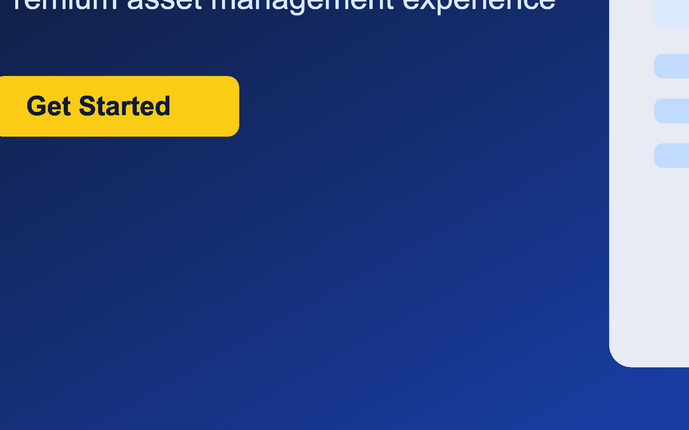
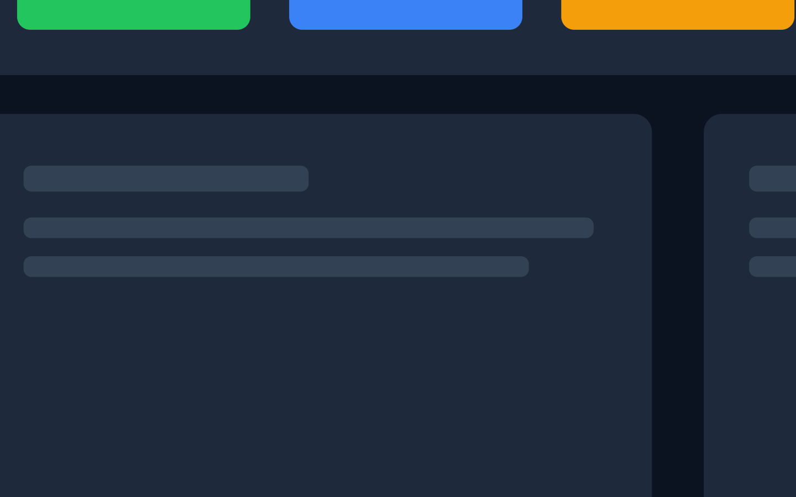
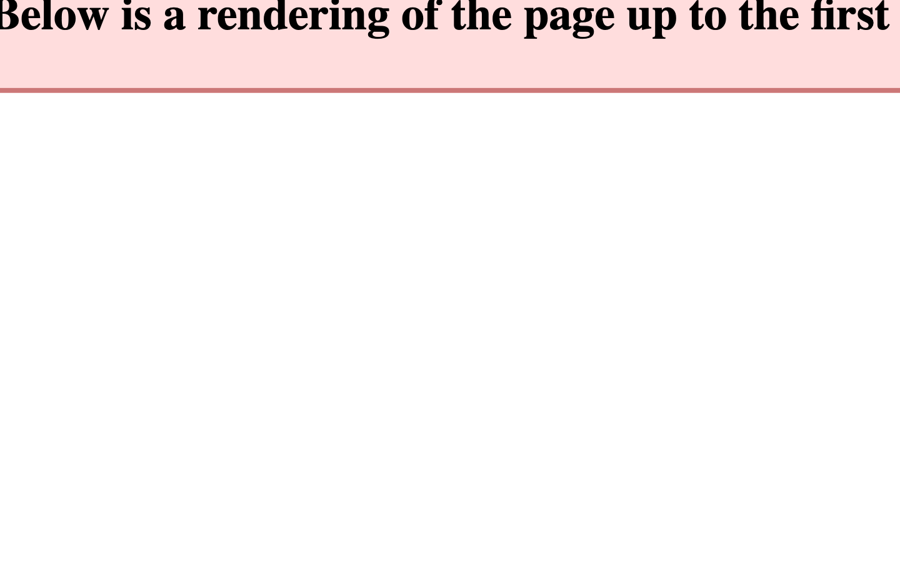
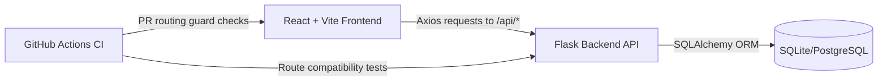

# Asset Inventory Management System

  

  

## Enterprise-style asset operations, built with production guardrails

> 🚀 Status: Production-ready full-stack system with CI-gated routing, E2E coverage, and deployed live environment.

This project is a full-stack asset management platform designed to demonstrate practical engineering quality: robust API integration, race-condition-aware UX workflows, end-to-end testing, and CI gates that prevent routing regressions from reaching `main`.

## Live Demo

- Frontend: <https://asset-inventory-management-system-1.onrender.com>
- Backend API: <https://asset-inventory-management-system-gkjx.onrender.com>

## What this system does

- Manage assets through full CRUD flows with status tracking and barcode support
- Organize data by category, type, vendor, and department
- Filter/search assets efficiently for operations teams
- Support image upload + preview in asset records
- Provide a scalable foundation for reports and lifecycle insights

## UI Preview

> Replace these placeholder visuals with real screenshots anytime without changing README structure.

### Landing Experience

## 📊 Dashboard

## 📦 Asset Management

## 📸 Screenshots Guidelines

To maintain consistency in UI presentation:

- Recommended size: **1440 × 900**
- Format: **PNG** (preferred for GitHub rendering)
- Max size: **< 500KB per image**
- Keep UI centered with visible navigation and key actions
- Use light compression (avoid blur artifacts)

Current screenshots are stored in:

- `docs/screenshots/`

## Architecture (high level)

## Key Engineering Highlights

- **Playwright E2E coverage for critical flows**
  - API routing smoke checks validate category/vendor/department endpoints and dropdown behavior.
- **CI routing enforcement with PR blocking**
  - Pull requests are gated by stable required checks to prevent frontend/backend route drift.
- **Optimistic UI + race-condition handling**
  - UX flows stay responsive while E2E coverage targets edge cases and concurrency-sensitive asset operations.
- **Centralized API resolution strategy**
  - Frontend uses a shared API config/client to eliminate hardcoded endpoint drift across environments.
- **Production deployment + verification ready**
  - Live frontend/backend deployments with automated regression workflows for ongoing confidence.

## Tech Stack

- **Frontend:** React, Vite, Redux Toolkit, Axios
- **Backend:** Flask, SQLAlchemy, Flask-Migrate, Flask-CORS
- **Quality:** Playwright, Jest, Pytest, GitHub Actions
- **Deployment:** Render (frontend + backend)

## Engineering & CI Details

For detailed CI enforcement, branch-protection-sensitive job names, routing guardrails, and troubleshooting:

- `docs/ci-guardrails.md`

