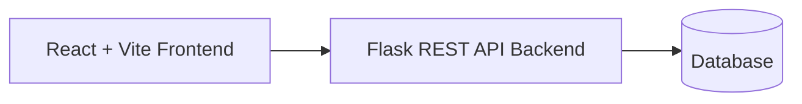
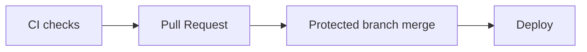

# Asset Inventory Management System

Full-stack enterprise-grade asset tracking platform with CI-gated reliability and production deployment.

[](frontend/)
[](backend/)
[](#-testing-strategy)
[](#-cicd--quality-gates)
[](LICENSE)

**Live Demo:** [🔗 Live App](https://asset-inventory-management-system-1.onrender.com) · [🔗 API](https://asset-inventory-management-system-gkjx.onrender.com)

**Tech highlights:** React • Flask • Playwright • CI/CD • Vite • REST APIs


## 📌 Project Overview

The Asset Inventory Management System helps organizations track, organize, and report physical assets across departments and teams.

This system was engineered with production reliability in mind, including CI-enforced routing safety, E2E testing, and optimistic UI with rollback protection.

### Purpose

- Replace fragmented spreadsheets/manual tracking with a centralized system
- Improve asset lifecycle visibility (assignment, availability, status, and reporting)
- Reduce operational friction with fast filtering, dashboards, and reliable API-driven workflows

### Target Users

- Organizations managing hardware/equipment inventories
- Operations/admin teams handling procurement and assignment
- Department managers who need reporting and analytics visibility

This is a full-stack architecture designed for real deployment environments, with CI checks, route compatibility validation, and test automation.

## 🚀 Key Features

- Full asset CRUD: **Create, Read, Update, Delete**
- Asset dimensions and metadata management:
  - Categories
  - Departments
  - Vendors
  - Asset types
- Advanced filtering and search for rapid inventory lookup
- Dashboard analytics and chart-based insights
- Simple premium landing homepage with clear product messaging and CTA flow
- Optimistic UI updates with rollback safety patterns
- UX resilience via loading, error, and empty states
- Role-ready architecture for future RBAC/permission expansion

## ✨ What Makes This Different

Unlike typical CRUD apps, this project includes:

- CI-gated API routing validation
- Race-condition-safe optimistic UI behavior
- Full E2E regression coverage for key workflows
- Deployment-ready architecture with environment-driven configuration

## 🏗️ System Architecture

### Stack Layers

- **Frontend:** React + Vite
- **Backend:** Flask (Python)
- **API style:** RESTful endpoints
- **CI/CD:** GitHub Actions workflow gates
- **Testing:** Playwright E2E + backend compatibility coverage

### Runtime Flow



### Delivery Pipeline



## ⚙️ Tech Stack

### Frontend

- React
- Vite
- Axios
- React Router

### Backend

- Flask
- Python
- REST APIs

### Testing & CI

- Playwright (E2E)
- Pytest
- GitHub Actions

## 🔐 CI/CD & Quality Gates

The project follows a PR-gated workflow to maintain production quality:

- Protected branch policy (no direct pushes to protected branches)
- Routing guard CI checks to catch frontend/backend route mismatch risk early
- Backend route compatibility checks for API stability
- Playwright E2E validation in CI for critical user flows
- Full test suite expected on mainline integration and scheduled/nightly quality runs

## 🧪 Testing Strategy

- **Unit/functional testing**
  - Frontend: Jest-based component/logic testing
  - Backend: Pytest for service and route behavior
- **End-to-end validation**
  - Playwright for user-critical workflows across pages and API boundaries
- **Reliability validation**
  - Race-condition-sensitive UI flow checks
  - API failure fallback behavior
  - Empty-state rendering and invalid-input handling

## 🌐 Deployment

- Frontend is deployed from a Vite production build
- Backend is deployed as an API service
- Configuration is environment-driven (dev/staging/prod-ready)
- API base URL handling is centralized to reduce configuration drift

### Live Links

- Frontend: [asset-inventory-management-system-1.onrender.com](https://asset-inventory-management-system-1.onrender.com)
- Backend: [asset-inventory-management-system-gkjx.onrender.com](https://asset-inventory-management-system-gkjx.onrender.com)

## 📂 Project Structure

```text
asset-inventory-management-system/
├── frontend/
├── backend/
├── tests/
├── ci/                # GitHub Actions workflows (.github/workflows)
├── docs/
│   └── screenshots/
└── assets/
```

## 📸 Screenshots

> Add screenshots in `docs/screenshots/` and keep filenames consistent with the placeholders below.

- Dashboard view  
  
- Asset table  
  
- Landing page  
  

## ⚠️ Known Issues / Notes

- Playwright report artifacts should be excluded from source control
- Dev-only logs should remain disabled in production deployment
- Backend maintains support for both `/api/*` and legacy route compatibility where applicable

## 🚀 Getting Started

### 1) Clone the repository

```bash
git clone https://github.com/sjmanyarkiy/asset-inventory-management-system.git
cd asset-inventory-management-system
```

### 2) Frontend

```bash
cd frontend
npm install
npm run dev
```

> Note: In this repository, `npm start` is also commonly used for local Vite dev startup.

### 3) Backend

```bash
cd backend
python main.py
```

### 4) Tests

```bash
npm run test:e2e
pytest
```

> If `test:e2e` is not defined in your local scripts, use your configured Playwright command (for example, `npx playwright test`).

## 🧠 Developer Highlights

- CI-gated routing checks that reduce API contract regressions
- Optimistic UI architecture with rollback safeguards for async failures
- Centralized API configuration patterns for environment portability
- Production-oriented full-stack separation (frontend, REST backend, deployment-ready boundaries)
- Multi-layer testing strategy (unit + integration + E2E)

## 👥 Team

- **Scrum Master:** Sandra Manyarkiy
- **Members:** Bneson Mwangi, Ajok Yai, Samuel Emanman

## License

This project is licensed under the MIT License. See the `LICENSE` file for details.


